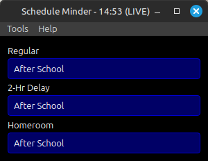

# Schedule Minder

A flexible schedule tracking application built with PyQt6 that helps users monitor multiple schedules simultaneously.



## Features
- Real-time schedule tracking
- Multiple schedule support (Regular, Delay, Homeroom)
- Customizable colors and appearance
- System tray integration with status tooltips
- Test mode for schedule verification
- Configurable window sizes
- Password-protected admin features
- Dark mode interface

## Quick Start
1. Ensure Python 3.8+ is installed
2. Install required packages:
   ```bash
   pip install PyQt6
   ```
3. Run the application:
   ```bash
   python main.py
   ```

## Documentation
- [User Guide](docs/user_guide.md) - How to use the application
- [Installation Guide](docs/installation.md) - Detailed setup instructions
- [Configuration Guide](docs/configuration.md) - Customize the application
- [Developer Guide](docs/developer/README.md) - Technical documentation
- [API Reference](docs/api/README.md) - Class and method documentation
- [Contributing](docs/CONTRIBUTING.md) - How to contribute

## Default Admin Password
The default password for admin features is: `chucksoft`

## License
[MIT License](LICENSE)

## Support
For support, please contact info@fragillidaesoftware.com 