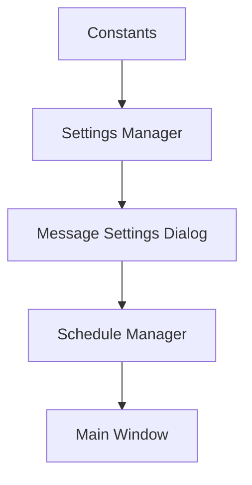

# Schedule Minder Developer Guide

## Project Architecture

### Directory Structure
```
schedule-minder/
├── main.py              # Application entry point
├── constants.py         # Global constants and configuration
├── assets/             # Application resources
├── data/               # Application data
├── windows/            # Window classes
│   ├── __init__.py
│   ├── base_window.py  # Base window functionality
│   └── schedule_window.py  # Main application window
├── dialogs/            # Dialog window classes
│   ├── __init__.py
│   ├── about_dialog.py
│   ├── color_settings.py
│   ├── schedule_editor.py
│   └── window_size_dialog.py
└── utils/              # Utility classes
    ├── __init__.py
    ├── about_manager.py
    ├── schedule_manager.py
    ├── settings_manager.py
    ├── test_file_helper.py
    └── ui_helper.py
```

## Core Components

### Main Window (schedule_window.py)
The main window handles:
- Schedule display and updates
- System tray integration
- Menu creation
- Settings management
- Test mode functionality

```python
class ScheduleWindow(BaseWindow):
    def __init__(self, enable_test_mode=False):
        # Initialize window
        # Set up managers
        # Create UI elements
        # Configure system tray
```

### Schedule Manager (schedule_manager.py)
Handles all schedule-related operations:
- Loading schedule data
- Event calculations
- Time comparisons
- Schedule updates

```python
class ScheduleManager:
    def get_current_event(self, schedule_type, current_time=None):
        # Calculate current event based on time
        # Handle special cases (before/after schedule)
        # Return event information
```

### Settings Manager (settings_manager.py)
Manages application settings:
- Color schemes
- Window sizes
- Admin password
- Persistent storage

### Message System
The message system consists of three main components:

1. **Message Configuration (constants.py)**
   - Defines default messages and placeholders
   - Provides consistent message keys across application

2. **Message Management (utils/settings_manager.py)**
   - Handles loading/saving of custom messages
   - Maintains persistence of message settings

3. **Message UI (dialogs/message_settings.py)**
   - Provides interface for message customization
   - Handles message format validation

### Component Interaction


### Message Implementation
```python
# Loading messages
messages = settings_manager.get_schedule_messages()

# Formatting messages
formatted_message = messages['during_period'].format(
    event_name=current_event
)

# Saving messages
settings_manager.save_schedule_messages(new_messages)
```

## Key Concepts

### Schedule Structure
Schedules are organized as:
```json
{
    "organization_name": {
        "schedule_1": {
            "name": "Display Name",
            "events": [
                {
                    "name": "Event Name",
                    "start": "HH:MM",
                    "end": "HH:MM",
                    "minutes": integer
                }
            ]
        }
    }
}
```

### Time Handling
- All times use 24-hour format (HH:MM)
- Time comparisons use datetime objects
- Special handling for overnight periods

## Development Workflow

### Setting Up Development Environment
1. Create virtual environment
2. Install development dependencies
3. Configure IDE for PyQt6

### Running Tests
```bash
# Run all tests
python -m pytest tests/

# Run specific test file
python -m pytest tests/test_schedule_manager.py

# Run with coverage
python -m pytest --cov=src tests/
```

### Code Style
- Follow PEP 8
- Use type hints
- Document all public methods
- Keep methods focused and small

## Common Development Tasks

### Adding a New Dialog
1. Create new file in dialogs/
2. Inherit from QDialog
3. Implement UI in setup_ui()
4. Add to menu/trigger in schedule_window.py

### Modifying Schedules
1. Update schedule format in schedule_manager.py
2. Modify schedule editor dialog
3. Update event calculations
4. Test with various time scenarios

### Adding Settings
1. Add constants to constants.py
2. Update settings_manager.py
3. Create UI elements if needed
4. Add save/load functionality

## Testing

### Test Categories
1. Unit Tests
   - Individual component testing
   - Mocked dependencies
2. Integration Tests
   - Component interaction
   - File operations
3. UI Tests
   - Widget behavior
   - User interaction

### Test Files
```python
# test_schedule_manager.py
def test_get_current_period():
    manager = ScheduleManager()
    period = manager.get_current_period(
        "Regular Schedule",
        datetime.strptime("08:30", "%H:%M")
    )
    assert period == "Period 1"
```

## Debugging

### Debug Mode
```python
# Enable debug logging
import logging
logging.basicConfig(level=logging.DEBUG)
```

### Common Issues
1. Event Calculation
   - Check time format
   - Verify event overlaps
   - Test edge cases

2. UI Updates
   - Monitor signal connections
   - Check update triggers
   - Verify data flow

## Performance Considerations

### Memory Management
- Clear unused resources
- Monitor widget creation/deletion
- Use weak references when appropriate

### UI Responsiveness
- Avoid blocking operations
- Use background threads for I/O
- Batch UI updates

## Contributing

### Pull Request Process
1. Fork repository
2. Create feature branch
3. Write tests
4. Update documentation
5. Submit PR

### Code Review Guidelines
- Verify test coverage
- Check documentation
- Ensure style compliance
- Test on all platforms

## Resources

### PyQt6 Documentation
- [Official Documentation](https://www.riverbankcomputing.com/static/Docs/PyQt6/)
- [Qt Documentation](https://doc.qt.io/qt-6/)

### Project Links
- [Issue Tracker](https://github.com/your-repo/schedule-minder/issues)
- [Wiki](https://github.com/your-repo/schedule-minder/wiki) 